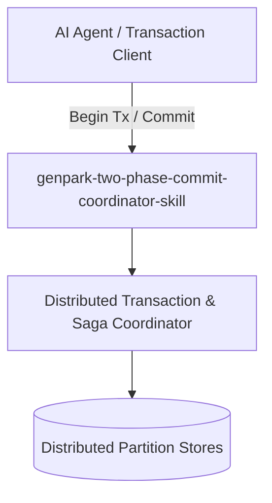

# genpark-two-phase-commit-coordinator-skill

[](https://github.com/alphaparkinc/genpark-two-phase-commit-coordinator-skill/actions)
[](https://opensource.org/licenses/MIT)
[](https://www.python.org/downloads/)

> Two-Phase Commit (2PC) distributed atomic transaction coordinator executing prepare voting, commit distribution, and write-ahead log recovery.

## Architecture



## Features
- Pure standard library Python implementation with strictly zero pip dependencies.
- Production-grade transactional patterns (2PC, Saga compensations, TCC reservations, Percolator).
- Native Model Context Protocol (MCP) server support for AI agent distributed transactions.

## Installation

```bash
git clone https://github.com/alphaparkinc/genpark-two-phase-commit-coordinator-skill.git
cd genpark-two-phase-commit-coordinator-skill
```

## Quickstart

```bash
python example_usage.py
```
